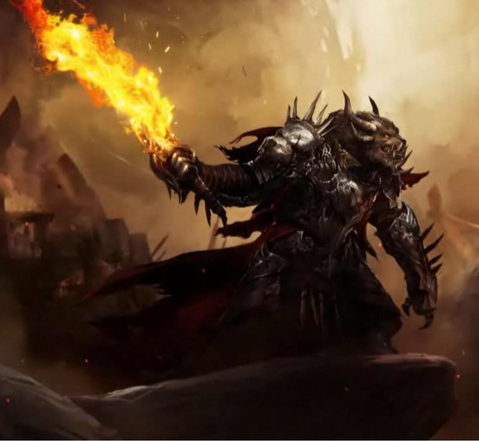

# Rytlock Brimstone

> **Type:** PC
> **Race:** Leonin
> **Class:** Fighter (Champion) — Level 4
> **Background:** Soldier
> **Alignment:** Lawful Neutral
> **Player:** Geoff

---

## Ability Scores

| Ability | Score | Modifier |
|---------|-------|----------|
| STR     | 16    | +3       |
| DEX     | 10    | +0       |
| CON     | 15    | +2       |
| INT     | 8     | -1       |
| WIS     | 12    | +1       |
| CHA     | 14    | +2       |

## Combat

| Stat       | Value                    |
|------------|--------------------------|
| AC         | 18 (chain mail + shield) |
| Initiative | +0                       |
| Speed      | 35 ft.                   |
| Max HP     | 36                       |
| Hit Dice   | 4d10                     |

## Proficiency

- **Proficiency Bonus:** +2
- **Saving Throws:**

| Save | Ability | Bonus | Prof |
|------|---------|-------|------|
| Strength | STR | **+5** | ✓ |
| Dexterity | DEX | +0 | |
| Constitution | CON | **+4** | ✓ |
| Intelligence | INT | -1 | |
| Wisdom | WIS | +1 | |
| Charisma | CHA | +2 | |

- **Skills:**

| Skill | Ability | Bonus | Prof |
|-------|---------|-------|------|
| Acrobatics | DEX | +0 | |
| Animal Handling | WIS | +1 | |
| Arcana | INT | -1 | |
| Athletics | STR | **+5** | ✓ |
| Deception | CHA | +2 | |
| History | INT | -1 | |
| Insight | WIS | +1 | |
| Intimidation | CHA | **+4** | ✓ |
| Investigation | INT | -1 | |
| Medicine | WIS | +1 | |
| Nature | INT | -1 | |
| Perception | WIS | +1 | |
| Performance | CHA | +2 | |
| Persuasion | CHA | +2 | |
| Religion | INT | -1 | |
| Sleight of Hand | DEX | +0 | |
| Stealth | DEX | +0 | |
| Survival | WIS | +1 | |

## Features & Traits

### Racial Traits (Leonin)
- **Darkvision:** 60 ft.
- **Claws:** Natural weapon, 1d4+3 slashing
- **Daunting Roar:** As a bonus action, creatures of your choice within 10 ft. must succeed on a WIS save (DC 12) or become frightened until end of your next turn. Once per short/long rest.

### Class Features (Fighter)
- **Fighting Style — Great Weapon Fighting:** When you roll a 1 or 2 on a damage die for an attack with a two-handed or versatile weapon (wielded in two hands), you can reroll and must use the new roll.
- **Second Wind:** As a bonus action, regain 1d10+4 HP. Once per short/long rest.
- **Action Surge:** Take one additional action on your turn. Once per short/long rest.
- **Subclass: Champion**
  - **Improved Critical:** Critical hit on a roll of 19 or 20

### Feats
- **Great Weapon Master:** Before you make a melee attack with a heavy weapon you're proficient with, you can choose to take a -5 penalty to the attack roll. If the attack hits, you add +10 to the damage. Additionally, on your turn when you score a critical hit or reduce a creature to 0 HP with a melee weapon, you can make one melee weapon attack as a bonus action.

## Equipment (Base Loadout)

### Weapons
- **Greatsword:** +5 to hit, 2d6+3 slashing (two-handed)
- **Light Crossbow:** +2 to hit, 1d8 piercing (range 80/320)
- **Mace:** +5 to hit, 1d6+3 bludgeoning

### Armor
- **Chain Mail:** AC 16 (base)
- **Shield:** +2 AC

## Personality

- **Traits:** Gruff and direct — doesn't suffer fools. Hides fierce loyalty behind a wall of sarcasm and growling. Leads from the front and expects others to keep up.
- **Ideals:** Strength is earned through perseverance, not birthright. You prove yourself through action, not words.
- **Bonds:** The Stone Warband — his found family. His allies are everything to him, even if he'd never say it out loud. Carries Sohothin as both weapon and legacy.
- **Flaws:** Carries guilt over past failures — friends he couldn't protect, enemies he couldn't finish. His pride pushes him to reckless decisions. Struggles to be vulnerable or express what he actually feels.

## Notes

### Appearance

Leonin (charr-inspired). Stocky but powerful build — was the runt of his litter but grew into a feared warrior. Sharp teeth, claws, tail that flicks when irritated. Carries himself with the authority of a tribune.

### Backstory
Blood Legion Tribune and former leader of the Stone Warband. Born the smallest of the striplings in his fahrar — nicknamed "Runtlock" — he was abandoned by his parents and bullied by his peers. He turned that into fuel, rallied the other underdogs, and forged them into the Stone Warband. Rose through the ranks from Legionnaire to Tribune by tooth, claw, and fire.

Infiltrated a Flame Legion garrison alongside Crecia Stoneglow on orders from Imperator Bangar Ruinbringer. There he discovered and claimed Sohothin, a legendary fire sword. Rode with Destiny's Edge — a multi-racial guild — and fought the Elder Dragon Kralkatorrik. The battle failed, and Rytlock carries guilt over not being able to protect his allies or finish the fight.

Now fights with Dragon's Watch because standing still means dying slow — and because the people beside him are worth fighting for.

### Allies & Organizations
- **Blood Legion** — his charr legion
- **Stone Warband** — his warband, ~24 soldiers
- **Destiny's Edge** — former adventuring guild
- **Dragon's Watch** — current adventuring guild
- **Crecia Stoneglow** — close ally, fellow infiltrator
- **Bangar Ruinbringer** — former Imperator (complicated history)
- **Caithe, Taimi, Braham** — allies in Dragon's Watch

### Additional Notes
- Inspired by Rytlock Brimstone from Guild Wars 2
- Sohothin (legendary fire sword) is part of his lore but not yet in D&D equipment — may be introduced later as a magic item
- Great Weapon Fighting style pairs with the greatsword; shield is carried for defensive situations (swap as needed)
- See `backstory.pdf` in this folder for the full character voice profile
